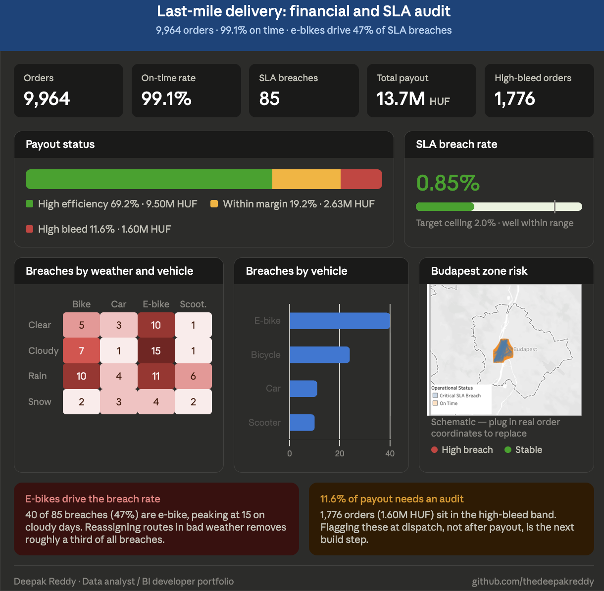

# Last-Mile Delivery Analytics — Budapest

**An end-to-end analytics project: SQL data engineering, Python machine learning, and an executive Tableau dashboard.**
Auditing ~10,000 courier deliveries across Budapest for **financial leakage** and **SLA breaches**.

<p>
  
  
  
  
</p>


---

## The Business Problem

A food-delivery platform pays couriers through a **dynamic pricing engine**: a base drop fee, a per-kilometre rate, and multipliers for peak hours and bad weather. At scale, two things go wrong quietly:

1. **Financial bleed** — the multipliers overpay on certain routes, and nobody notices because every individual payout looks reasonable.
2. **SLA breaches** — some deliveries run far over their expected time, damaging customer retention.

This project builds the pipeline an operations team would actually need to **find both problems, quantify them in forints, and put them on a screen a manager can read in ten seconds**.

---

## Headline Results

| Finding | Number |
|---|---|
| Orders audited (Oct 2025 – Mar 2026) | **9,964** |
| Total courier payout analysed | **13.7M HUF** |
| Orders flagged as *High Bleed* (>1.25x cohort cost/km) | **1,776 orders — 17.8% of orders, 11.6% of spend (1.60M HUF)** |
| Estimated overspend vs. cohort baseline | **~686,000 HUF (5.0% of spend)** |
| Critical SLA breaches (>15 min over rolling expectation) | **85 orders — 0.85%, so 99.1% on time** |
| Share of all breaches ridden by e-bikes | **40 of 85 (47%)** |
| Breach rate in snow vs. clear weather | **2.48% vs 0.48% — 5.2x worse** |
| Breach rate on cross-Danube routes vs. intra-district | **1.69% vs 0.26% — 6.5x worse** |

*Note on the two bleed percentages: 17.8% counts flagged orders, 11.6% weights them by forints. Flagged orders skew short and cheap, which is itself the finding — see insight 1.*

---

## Three Insights a Manager Can Act On

**1. The dinner rush overpays.**
Average cost-per-kilometre sits near **440 HUF** for most of the day, but jumps to **557 / 568 / 592 HUF** at 18:00, 19:00 and 20:00. The share of orders flagged as high-bleed rises from a ~16% baseline to **26–30%** in that same window. The peak multiplier is stacking on top of short, dense city-centre trips that don't need it.
*Recommendation: cap the peak multiplier below a distance threshold.*

**2. Light vehicles fail in bad weather; cars don't.**
E-bikes account for **47% of all SLA breaches** (40 of 85) despite being one vehicle class of four, breaching at **1.60%** against **0.45%** for cars and **0.40%** for scooters. Weather drives it — the overall breach rate climbs from 0.48% in clear conditions to **2.48% in snow**.
*Recommendation: weather-aware dispatch. Reassigning light-vehicle routes in poor conditions removes roughly a third of all breaches.*

**3. The river is the bottleneck.**
Deliveries crossing between Buda and Pest average **5.5 km** vs 2.9 km intra-district, and breach SLA **6.5x more often**.
*Recommendation: a supply hub in District XI (Ujbuda) would remove most cross-Danube legs.*

---

## Architecture

```
Simulation (Python)  ->  PostgreSQL audit layer  ->  ML pipeline (scikit-learn)
                                  |
                                  v
                       Tableau spatial dashboard
```

### 1. Data Engineering — PostgreSQL
The core of the project is a single layered CTE query ([`sql_queries/Script-25.sql.sql`](sql_queries/Script-25.sql.sql)) that turns raw delivery logs into an audit table:

- **`order_metrics`** — derives `actual_cost_per_km` and `speed_kmh` per order, with `NULLIF` guards against divide-by-zero.
- **`cohort_baselines`** — the analytical heart. Two window functions establish *fair* expectations:
  - `AVG(...) OVER (PARTITION BY courier_vehicle, weather_condition)` — an e-bike in the snow is only compared to other e-bikes in the snow.
  - `AVG(...) OVER (PARTITION BY shift_hour, courier_vehicle ORDER BY order_timestamp ROWS BETWEEN 50 PRECEDING AND CURRENT ROW)` — a **rolling 50-order expectation** that adapts to conditions on the ground instead of a fixed SLA.
- **`anomaly_detection`** — classifies each order: `High Bleed (Audit Required)` above 1.25x cohort cost/km, `High Efficiency` below 0.85x, and `Critical SLA Breach` when actual time exceeds the rolling expectation by 15+ minutes.

*Why it matters:* comparing every order against a like-for-like, time-aware baseline is what separates a real anomaly from "it was snowing."

### 2. Predictive Modelling — Python / scikit-learn
[`Notebooks/delivery_delay_prediction_updated.ipynb`](Notebooks/delivery_delay_prediction_updated.ipynb) asks whether an SLA breach can be predicted **before dispatch**.

- A `ColumnTransformer` and `Pipeline` (StandardScaler for numerics, OneHotEncoder for categoricals) feeding a `RandomForestClassifier(class_weight='balanced')`.
- **Strict leakage control:** only features known at dispatch time — hour of day, vehicle type, weather, estimated distance. Actual delivery time and payout are deliberately excluded.
- Stratified 80/20 split to preserve the rare positive class.

**Honest result:** the model reaches 98% accuracy — but that is the accuracy of *predicting "on time" every single time*. With only 85 breaches in 9,964 orders (0.85%), recall on the breach class is **0.00**. Accuracy here is a **trap metric**, and the notebook shows exactly that.

**What I'd do next:** resample with SMOTE, tune the decision threshold on precision-recall rather than accuracy, evaluate on PR-AUC, and add the features the SQL layer already proves matter — cross-river flag, distance-by-weather interaction, and courier-level rolling history. Documented as an open problem rather than papered over.

### 3. Visualisation — Tableau
[`Notebooks/Book1.twbx`](Notebooks/Book1.twbx) — a card-based executive dashboard:

- **Hub-and-spoke spatial map** built with `MAKEPOINT` and `MAKELINE` to draw every restaurant-to-customer route across the city.
- **Dual-donut gauges** for SLA compliance and financial-bleed percentage.
- **24-hour cost curve** that makes the dinner-rush spike visible instantly.
- Interactive filters on vehicle, weather and district; front-end calculated fields used where the source schema was fixed.



---

## Repository Structure

```
data/
  budapest_delivery_simulation_2026.csv   10,000 raw simulated delivery logs
  anomaly_detection_202605211808.csv      audited output of the SQL pipeline
sql_queries/
  Script-24.sql.sql                       schema / table definition
  Script-25.sql.sql                       anomaly + SLA audit query (CTEs, window functions)
Notebooks/
  budapest_delivery_simulation_2026.ipynb data generator (haversine, pricing logic)
  delivery_delay_prediction.ipynb         first ML pass
  delivery_delay_prediction_updated.ipynb final pipeline + geo-enrichment join
  Book1.twbx                              Tableau workbook
assets/
  audit-summary.png                       headline metrics summary
  dashboard.png                           Tableau dashboard screenshot
```

---

## Reproduce It

```bash
git clone https://github.com/thedeepakreddy/Last-Mile-Delivery-Analytics-Budapest.git
cd Last-Mile-Delivery-Analytics-Budapest
pip install pandas numpy scikit-learn jupyter
```

1. **(Optional) Regenerate the data** — run `Notebooks/budapest_delivery_simulation_2026.ipynb` (seeded with `np.random.seed(42)`, so it's reproducible).
2. **Load and audit in PostgreSQL**
   ```bash
   psql -d delivery_db -f sql_queries/Script-24.sql.sql
   \copy delivery_logs FROM 'data/budapest_delivery_simulation_2026.csv' CSV HEADER
   psql -d delivery_db -f sql_queries/Script-25.sql.sql
   ```
3. **Model it** — run `Notebooks/delivery_delay_prediction_updated.ipynb` against the audited export.
4. **Explore the dashboard** — open `Notebooks/Book1.twbx` in Tableau Desktop or Public.

---

## Scope and Honesty Notes

- **The data is simulated, not proprietary.** It's generated from a documented model: haversine distance x 1.3 for road routing, a 600 HUF drop fee plus 150 HUF/km base, a 1.25x peak multiplier (18:00-21:00), and weather multipliers up to 1.75x for snow. This keeps the project fully shareable while the *analysis* — the window functions, the leakage discipline, the spatial modelling — is exactly what I'd apply to real logs.
- Because the pricing rules are known, the SQL layer is validated against ground truth: the bleed it detects at 18:00-20:00 is the peak multiplier, correctly recovered from the data alone.
- The classifier does **not** currently solve the imbalance problem. That's stated plainly above rather than hidden behind an accuracy score.

---

## Skills Demonstrated

`PostgreSQL` · `Window Functions` · `CTEs` · `Anomaly Detection` · `Python` · `Pandas` · `NumPy` · `scikit-learn` · `Pipelines & ColumnTransformer` · `Class Imbalance` · `Data-Leakage Prevention` · `Geospatial Analysis` · `Tableau` · `Dashboard Design` · `Business Storytelling`

---

## Author

**Gorisi Deepak Reddy** — Data Analyst, Budapest, Hungary

[LinkedIn](https://www.linkedin.com/in/deepak-reddy-038582223) · [GitHub](https://github.com/thedeepakreddy)

> Open to Data Analyst / Analytics Engineer roles. If any of the above is useful to your team, I'm happy to walk through the SQL or the dashboard live.
